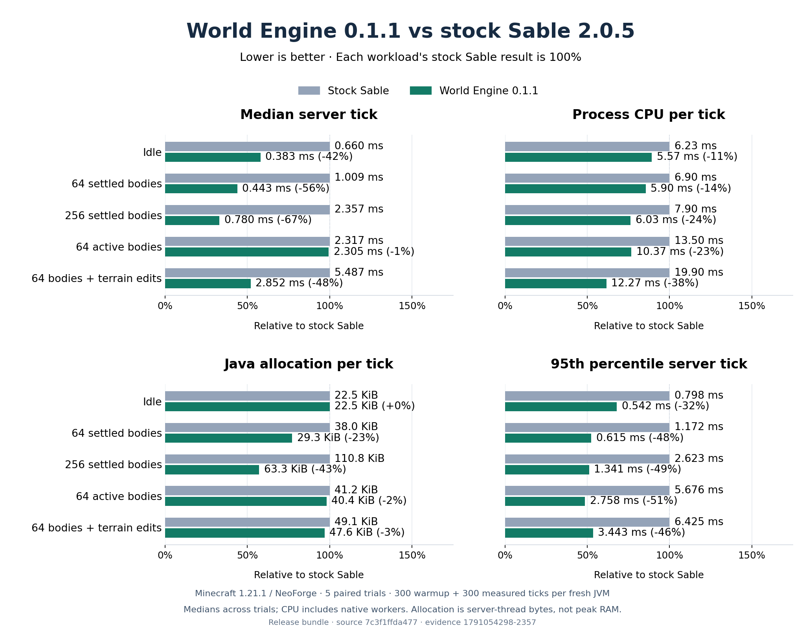

# World Engine

World Engine is a performance addon for [Sable](https://www.curseforge.com/minecraft/mc-mods/sable) on Minecraft 1.21.1. It is designed for worlds with many physics bodies and for large moving structures such as ships, stations, and terrain-scale contraptions.

It keeps Sable's configured physics substeps and solver settings. Its optimizations reduce repeated indexing, terrain streaming, and collision work.

## What it improves

- Adaptive spatial queries choose between section lookup and exact body scanning based on the real query cost.
- Very large bodies use an exact-AABB large-body tier instead of creating hundreds of thousands of section memberships.
- Changed-body JNI batching and active-pose synchronization reduce Java/native overhead.
- Persistent native registries, sparse world indexing, local Rapier regions, and bounded parallel stepping scale with active work.
- Incremental voxel geometry and terrain streaming avoid rebuilding unchanged collision data.
- Network level-of-detail and client extrapolation reduce unnecessary synchronization work.
- Sable's configured physics substeps remain in effect.

The full technical migration is documented in [MIGRATION.md](MIGRATION.md).

## Benchmark: 0.1.1 vs stock Sable

Five paired trials per workload on Minecraft 1.21.1 NeoForge used 50 fresh server
processes, each with 300 warmup and 300 measured ticks. Total process CPU fell
11–38% and p95 tick latency fell 32–51% across the five fixtures. Server-thread
Java allocation fell 2–43% in body workloads and was unchanged when idle.



Active-body median tick latency was effectively tied (0.5% lower). Server-thread
CPU increased 20% for active bodies and 8% with terrain edits, despite lower total
process CPU. These results do not establish that every metric improves.

See the [complete results and raw evidence](docs/benchmarks/2026-10-04/README.md),
[successful comparison run](https://github.com/UpperMoon0/World-Engine/actions/runs/37146595075),
and [benchmark protocol](BENCHMARKS.md). These dedicated-server fixtures do not
measure client FPS, retained RAM, arbitrary large ships or every addon.

## Requirements

- Minecraft 1.21.1
- Fabric or NeoForge
- Java 21
- [Sable 2.0.5 or newer](https://www.curseforge.com/minecraft/mc-mods/sable)

Install the World Engine jar for your loader alongside Sable. Do not install both loader variants.

## Compatibility

World Engine is a standalone addon, not a Sable fork. Sable continues to provide sublevels, compatibility integrations, rendering, configuration, and its public API. World Engine supplies a higher-priority physics provider and narrowly scoped optimizations for Sable hot paths.

Exact collision and AABB filtering are retained for large structures. The adaptive index changes query strategy only; it does not approximate body bounds or skip simulation.

## Building

Use Java 21:

```powershell
.\gradlew.bat build
```

Output jars are written to `fabric/build/libs` and `neoforge/build/libs`.

The normal build packages the checked-in native binaries. Rebuilding every release-native target requires Docker:

```powershell
.\gradlew.bat worldengine_rapier:buildImages
.\gradlew.bat worldengine_rapier:buildRustNatives
.\gradlew.bat build
```

Correctness tests run as part of `build`. Query crossover benchmarks are opt-in through `:common:jmh`.

For the real dedicated-server comparison against stock Sable, see [BENCHMARKS.md](BENCHMARKS.md).
Native and query microbenchmarks alone do not establish an in-game speedup.

## Releases and support

- [Version changelogs](changelog/)
- [GitHub releases](https://github.com/UpperMoon0/World-Engine/releases)
- [Issue tracker](https://github.com/UpperMoon0/World-Engine/issues)

World Engine is independently maintained by NsTut. Sable is developed by RyanHCode and its contributors.
