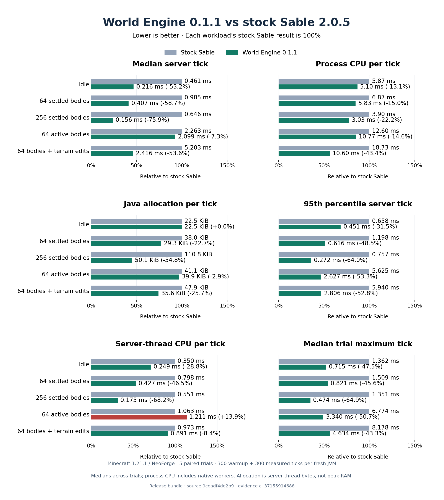

# World Engine 0.1.1 vs stock Sable 2.0.5

This clean, unprofiled release-bundle comparison passed all paired physics checks.
It covers Minecraft 1.21.1 dedicated servers on NeoForge with five paired trials
per workload: 50 fresh JVMs, each with 300 warmup and 300 measured ticks.

- [CI comparison](https://github.com/UpperMoon0/World-Engine/actions/runs/37155914688)
- Measured source: [`9ceadf4de2b9`](https://github.com/UpperMoon0/World-Engine/commit/9ceadf4de2b9426d46ed4d5066df7e009c702070)
- Evidence ID: `ci-37155914688`
- [All raw measurements and runtime evidence](result.json.gz)
- [Shared frozen source, resource and release-binary hashes](inputs.json.gz)
- [Complete frozen compiled-input hashes for every runner](shard-inputs.json.gz)
- Native bundle SHA-256: `cec2679c4cbb60dcea74efefbda13e94eac4abd594c89fe77071a7a4c101ddaa`

The figure measures the linked source revision. Later optimization commits need
a separate comparison; these archived numbers do not measure those commits.
The normal checked-in native bundle was used; development profiler libraries and
JFR recordings are excluded from these performance results.

## Results

Total process CPU, median/p95 tick latency and body-workload allocation improved
across all five workloads; idle allocation was unchanged. Active-body
server-thread CPU increased 13.9%. This run does not meet the target of improving
every metric.

Each cell gives stock Sable → World Engine and the percentage change. Lower is
better. Tick and allocation summaries are medians of each trial's median; CPU is
the median of each trial's full-window process CPU per tick. The p95 summary is
the median of the five per-trial 95th percentiles.

| Workload | Median tick (ms) | Process CPU (ms/tick) | Java allocation (KiB/tick) | p95 tick (ms) |
| --- | ---: | ---: | ---: | ---: |
| Idle | 0.461 → 0.216 (-53.2%) | 5.87 → 5.10 (-13.1%) | 22.5 → 22.5 (+0.0%) | 0.658 → 0.451 (-31.5%) |
| 64 supported bodies | 0.985 → 0.407 (-58.7%) | 6.87 → 5.83 (-15.0%) | 38.0 → 29.3 (-22.7%) | 1.198 → 0.616 (-48.5%) |
| 256 supported bodies | 0.646 → 0.156 (-75.9%) | 3.90 → 3.03 (-22.2%) | 110.8 → 50.1 (-54.8%) | 0.757 → 0.272 (-64.0%) |
| 64 active bodies | 2.263 → 2.099 (-7.3%) | 12.60 → 10.77 (-14.6%) | 41.1 → 39.9 (-2.9%) | 5.625 → 2.627 (-53.3%) |
| 64 bodies + terrain edits | 5.203 → 2.416 (-53.6%) | 18.73 → 10.60 (-43.4%) | 47.9 → 35.6 (-25.7%) | 5.940 → 2.806 (-52.8%) |



Maximum ticks are also retained. These are medians of the five per-trial maxima,
not a pooled maximum or a promise about every individual tick.

| Workload | Sable maximum (ms) | World Engine maximum (ms) | Change |
| --- | ---: | ---: | ---: |
| Idle | 1.362 | 0.715 | -47.5% |
| 64 supported bodies | 1.509 | 0.821 | -45.6% |
| 256 supported bodies | 1.351 | 0.474 | -64.9% |
| 64 active bodies | 6.774 | 3.340 | -50.7% |
| 64 bodies + terrain edits | 8.178 | 4.634 | -43.3% |

Average server-thread CPU over the measured tick intervals is retained alongside
total process CPU:

| Workload | Server-thread CPU (ms/tick), Sable → World Engine |
| --- | ---: |
| Idle | 0.350 → 0.249 (-28.8%) |
| 64 supported bodies | 0.798 → 0.427 (-46.5%) |
| 256 supported bodies | 0.551 → 0.175 (-68.2%) |
| 64 active bodies | 1.063 → 1.211 (+13.9%) |
| 64 bodies + terrain edits | 0.973 → 0.891 (-8.4%) |

The raw summary includes each metric's minimum, maximum and quartiles across
trials. Quartiles describe spread, not confidence intervals; individual ticks
are correlated and are not counted as independent trials.

## Inputs and correctness

- Runner: `Separate CI runner per workload; see shardHosts`; 4 reported processors.
- Java: `21.0.12.1+1-LTS`; VM: `OpenJDK 64-Bit Server VM`.
- Maximum heap: 2.0 GiB in both variants.
- Physics settings, identical in each pair: `solverIterations`=18, `pgsIterations`=2, `stabilizationIterations`=2, `contactSpringDampingRatio`=5.0, `contactSpringFrequency`=40.0, `minDynamicBodiesPerIsland`=128, `substepsPerTick`=2.
- Engine order alternates by trial. Every process uses a fresh, identically seeded
  flat world with no observers or existing player saves.
- Every trial retains the expected body population, finite supported poses and
  valid mass, and passes 19 independent exact-AABB queries. Supported paired
  poses agree within 0.15 blocks. Loaded mod sets and selected providers are checked.
- The input manifest is checked before and after each trial. Sources, classes,
  resources and shipped native/JAR inputs remain frozen throughout the comparison.

Process CPU includes native workers, networking, GC and workload commands between
tick intervals. Java allocation is the
server thread's cumulative allocation during measured tick intervals, not
retained memory, peak RAM or native allocation. Preparation, assembly, workload
commands and output I/O are outside those tick intervals. See the complete
[protocol and metric definitions](../../../BENCHMARKS.md).

## Validation and coverage

The implementation has 26 passing Java tests, 57 passing native tests, 18 passing
benchmark/JNI evidence tests. Of 13 runtime cases, all 10 required and two optional
cases pass; the optional assembly case fails in
[the measured revision's build](https://github.com/UpperMoon0/World-Engine/actions/runs/37155916854).
All six native release targets were rebuilt in
[native CI](https://github.com/UpperMoon0/World-Engine/actions/runs/37155304984).
Runtime regressions cover sleeping terrain support, support removal, a center
hole, rectangular-floor removal, half-height slabs and interacting bodies across
a forced-chunk region boundary. A ballistic exact-query assertion reproduces a
live-body query miss before bounding-box-driven refresh and passes after the fix.
The boundary test reproduces failure with the
preceding library and passes with the corrected bundle.

The optional all-blocks assembly test reports `create:item_drain` and
`create:millstone` with both World Engine and stock Sable. A separate local
Windows baseline run excluded the World Engine addon and used Sable's own
Rapier native library: both stock required cases passed, while the same two
block IDs failed assembly. Stock also failed its optional gravity and snag tests
in that run. The assembly source records these failures when entity counts change
after assembly; full compatibility for those cases remains unresolved. The
[stock runtime log](stock-gametests.log.gz) and
[baseline-only Gradle setup](stock-gametests.init.gradle) are archived. This
local correctness run supplies no performance numbers for the Linux figure.

The test counts follow the source annotations: eight World Engine cases and two
stock cases are required; stock gravity, snag and all-blocks assembly are optional.
Minecraft's log misleadingly prints the total number of cases as the number of
required tests. The stock run executes five cases, with two required passes and
three optional failures; the addon run executes 13, with 12 passes and one
optional failure.

These five server fixtures do not certify client FPS, observer networking,
save/reload, arbitrary large ships, joints, Fabric runtime or every addon.

## Reproduce

Use Java 21 and Python 3.11+ on an otherwise idle machine:

```sh
python tools/benchmark_sable.py --trials 5 --warmup 300 --ticks 300
```

Install matplotlib to recreate the figure from the archived measurements:

```sh
python tools/plot_benchmark.py docs/benchmarks/2026-10-04-9ceadf4/result.json.gz docs/benchmarks/2026-10-04-9ceadf4/world-engine-0.1.1.png --version 0.1.1
```

The stock GameTest baseline uses the archived setup and the same Java 21:

```sh
./gradlew -I docs/benchmarks/2026-10-04-9ceadf4/stock-gametests.init.gradle -PbenchmarkEngine=sable :benchmark:runStockGameTest
```

## Parallel workload provenance

Each workload ran its five paired trials on one dedicated CI runner. Workloads ran in parallel; every comparison is within one workload, and absolute timings across runners are not an overall score.

[Full per-runner frozen compiled-input manifests](shard-inputs.json.gz). Sources and release-bundle bytes agree across runners; every full compiled manifest stayed frozen within its runner.

- `active64`: `Linux-6.17.0-1022-azure-x86_64-with-glibc2.39`; evidence `1791063628-2483`.
- `edits64`: `Linux-6.17.0-1022-azure-x86_64-with-glibc2.39`; evidence `1791063628-2391`.
- `idle`: `Linux-6.17.0-1022-azure-x86_64-with-glibc2.39`; evidence `1791063626-2474`.
- `supported256`: `Linux-6.17.0-1022-azure-x86_64-with-glibc2.39`; evidence `1791063626-2247`.
- `supported64`: `Linux-6.17.0-1022-azure-x86_64-with-glibc2.39`; evidence `1791063626-2478`.
